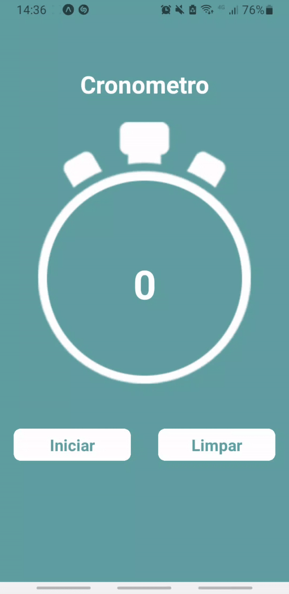

# Criando conta no Banco (React Native usando EXPO Cli) 

  <!-- iOS -->Baixe o Expo Go para rodar o aplicativo no celular
  
  <!-- Android -->
  

## Description/Descrição 
Aplicativo de cronometro e contagem do ultimo tempo percorrido.

Aprendendo a usar:
    - Picker, Slider, TouchableOpacity, { useState }, Switch, Button, TextInput

## 🚀 How to use/Como usar
    1º Iniciando o projeto em React Native.
    Abra seu terminal dentro da pasta raiz do projeto e digite o comando abaixo para iniciar:

        **npx expo start**
    
    2º Abrindo o projeto no celular.
    Após terminar o processo de start, abra o aplicativo Expo Go no seu celular e entre usando a URL manual ou escanendo o QR code:

        URL Manual: basta copiar a url que está aparecendo no terminal
        Ou
        QRcode: Basta clicar em "Scan QR code", automaticamente o projeto será carregado.
